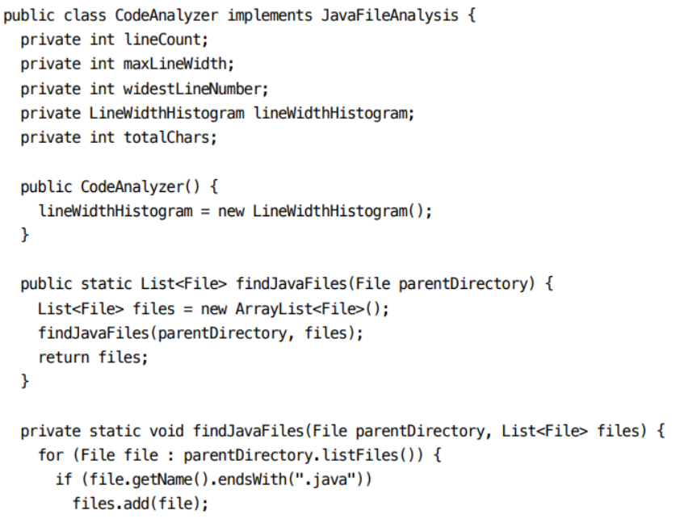

# 5장 형식 맞추기
- 코드는 형식에 맞춰 깔끔하게 작성되어야한다.
- 형식을 맞추기 위해 간단한 규칙이 필요하고, 팀 단위인 경우 팀 내부 규정이 있어야한다.


### 형식을 맞추는 목적
- ** 코드 형식은 중요하다. **
- 코드는 일종의 의사소통이다.
- 동작 위주의 코드는 앞으로 변경할 코드의 품질에 좋은 영향을 주지 못한다.
- 규칙에 맞게 작성된 코드는 가독성이 좋고, 앞으로의 유지보수와 확장성에 좋은 영향을 준다.

## 적절한 행 길이를 유지하라
- 큰 파일보다 작은 파일이 이해하기 쉽다.

### 신문 기사처럼 작성하라
- 기사의 내용이 요약된 표제처럼 소스 파일도 표제처럼 작성하는게 좋다.
- 이름은 간단하면서도 설명이 가능하게 짓는다.

### 개념은 빈 행으로 분리하라
- 빈 행은 새로운 개념의 시작을 시각화한다.

### 세로 밀집도
- 세로 밀집도는 연관성을 의미한다.
- 연관성이 밀접한 코드는 서로 가까이 놓는게 좋다.

### 수직 거리
- 변수 선언
  - 변수는 사용하는 위치에 최대한 가깝게 선언한다.
  - 루프를 제어하는 변수는 루프 문 내부에 선언한다.
    - `for(int i=0;i<10;i++)`
- 인스턴스 변수
  - 클래스의 맨 처음에 선언하고 변수간 세로로 거리를 두지 않는다.
- 종속 함수
  - 함수 A가 B를 호출한다면 A와 B는 세로로 가까이 배치한다.
  - 먼저 호출되는 함수를 먼저 배치한다.
- 개념적 유사성
  - 개념적 친화도가 높을수록 가까이 배치한다.
    - 친화도
      - 한 함수가 다른 함수를 호출하는 경우
      - 변수와 그 변수를 함수에서 사용하는 경우
      - 명명법이 동일하거나 기본 기능이 유사한 경우 등

### 세로 순서
- 호출 되는 함수를 호출하는 함수보다 나중에 배치해라
- 중요한 개념을 먼저 표현하고, 표현할 때 세세한 사항은 가장 마지막에 표현해라
- 코드가 고차원에서 저차원으로 흐르고, 개념 파악이 쉬워져 코드를 이해하기 쉬워진다.


## 가로 형식 맞추기
- 행은 짧을수록 바람직하다.

### 가로 공백과 밀집도
- 공백을 사용해 밀접한 개념과 느슨한 개념을 표현한다.
  - 연산자 양 옆의 공백
  - 쉼표 옆 공백 등

### 가로 정렬
- 구조 강조를 위한 가로 정렬은 의도가 가려질 수 있다.
- 정렬이 필요할 정도로 목록이 길어지는 코드는 의도에 따라 클래스를 나누는게 좋다.

### 들여쓰기
- 들여쓰기는 코드의 계층 위치에 비례해 작성한다.
- 범위가 시각적으로 표현되기 때문에 보다 코드 해석이 빨라진다.
- 짧은 함수에서도 들여쓰기로 범위를 제대로 표현하는게 좋다.

### 가짜범위
- 비어있는 구조도 들여쓰기를 올바르게 작성하고 세미콜론은 새 행에 작성해 눈에 띄게 한다.
```Java
while (dis.read(buf, 0, readBufferSize) != -1)
;
```

## 팀 규칙
- 개인이 선호하는 규칙보다 팀 규칙이 우선시 되어야한다.
- 팀 규칙을 정해야하고, 팀 규칙에 맞춰 코드 형식기 설정 후 사용하는게 좋다.
- **좋은 시스템은 읽기 쉬운 문서로 이뤄져야한다.**
  - 스타일은 일관적이고 매끄러워야한다.

## 밥 아저씨의 형식 규칙



> ## 책을 읽으며 궁금한 부분 
> 1) 코드를 작성할 때 개인의 기준이 있나요?
> 2) 짧은 함수에서 들여쓰기를 어떻게 표현하나요?